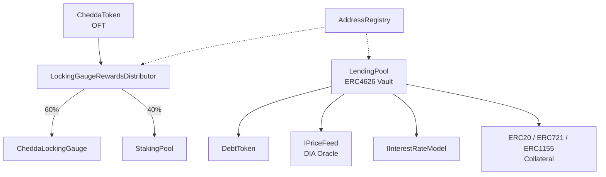

# Chedda Protocol

Chedda is a multi-collateral lending protocol built on ERC4626 tokenized vaults. It supports ERC-20, ERC-721, and ERC-1155 collateral, enabling borrowing against a wide range of on-chain assets. The protocol includes a native CHEDDA token with a halving emission schedule and staking rewards, and is cross-chain capable via LayerZero OFT. Licensed under BUSL-1.1.

## Architecture



**LendingPool** is the core vault: suppliers deposit assets and receive shares, borrowers post collateral and draw loans. **DebtToken** tracks outstanding debt as a non-transferrable ERC4626 token. Prices come from **IPriceFeed** (DIA oracle adapter), and interest accrues via a two-slope **IInterestRateModel**.

On the rewards side, **CheddaToken** mints emissions across 6 halving epochs. The **LockingGaugeRewardsDistributor** splits emissions between the **CheddaLockingGauge** (time-locked staking with boost multipliers) and **StakingPool** (standard ERC20 staking). **AddressRegistry** stores protocol-wide configuration and pool addresses.

## Contract Overview

| Contract | Description |
|---|---|
| `LendingPool` | ERC4626 vault implementing supply, borrow, and liquidation |
| `DebtToken` | Non-transferrable ERC4626 token tracking borrower debt |
| `CheddaToken` | OFT token with halving emission schedule (6 epochs) |
| `CheddaLockingGauge` | Time-locked CHEDDA staking with boost multipliers |
| `StakingPool` | Generic ERC20 staking with CHEDDA rewards |
| `LockingGaugeRewardsDistributor` | Distributes emissions across pools (60/40 gauge/staking split) |
| `DefaultInterestRateModel` | Two-slope kinked interest rate curve |
| `DIAPriceFeed` | DIA oracle adapter for token price feeds |
| `AddressRegistry` | Central registry for protocol addresses and pool management |

## Deployment

```shell
forge build
forge test
forge script script/<DeployScript> --rpc-url <RPC_URL> --broadcast
```

## Security

- [Hashlock Audit Report](audit/Chedda%20Finance%20Smart%20Contract%20Audit%20Report%20-%20Final%20Report.pdf)

## Links

- [Contract Documentation](docs/)
