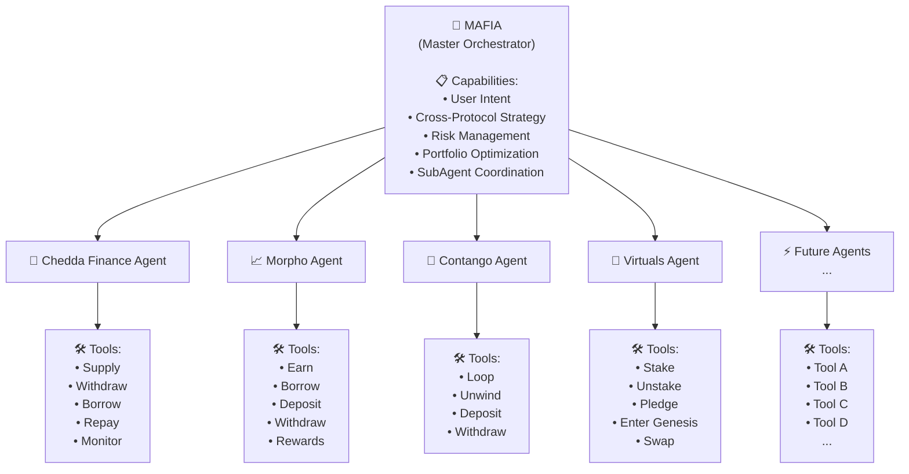

```mermaid
graph TD
    MAFIA["🎯 MAFIA<br/>(Master Orchestrator)<br/><br/>📋 Capabilities:<br/>• User Intent <br/>• Cross-Protocol Strategy<br/>• Risk Management<br/>• Portfolio Optimization<br/>• SubAgent Coordination"]
    
    MAFIA --> CF["🏦 Chedda Finance Agent"]
    MAFIA --> MA["📈 Morpho Agent"] 
    MAFIA --> CA["🔄 Contango Agent"]
    MAFIA --> VA["💎 Virtuals Agent"]
    MAFIA --> FA["⚡ Future Agents<br/>..."]
    
    CF --> CFT["🛠️ Tools:<br/>• Supply<br/>• Withdraw<br/>• Borrow<br/>• Repay<br/>• Monitor"]
    
    MA --> MAT["🛠️ Tools:<br/>• Earn<br/>• Borrow<br/>• Deposit<br/>• Withdraw<br/>• Rewards"]
    
    CA --> CAT["🛠️ Tools:<br/>• Loop<br/>• Unwind<br/>• Deposit<br/>• Withdraw"]
    
    VA --> VAT["🛠️ Tools:<br/>• Stake<br/>• Unstake<br/>• Pledge<br/>• Enter Genesis<br/>• Swap"]
    
    FA --> FAT["🛠️ Tools:<br/>• Tool A<br/>• Tool B<br/>• Tool C<br/>• Tool D<br/> ... "]

```