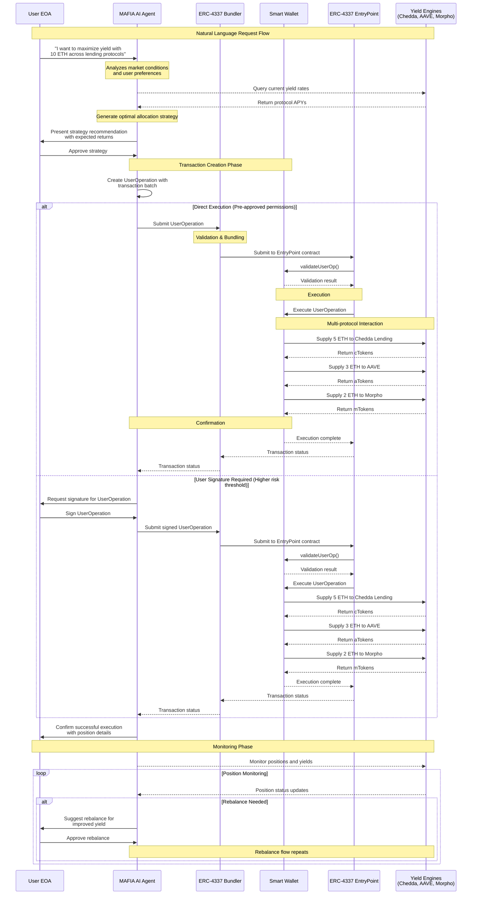

```mermaid
sequenceDiagram
    participant User as User EOA
    participant MAFIA as MAFIA AI Agent
    participant Bundler as ERC-4337 Bundler
    participant Wallet as Smart Wallet
    participant EntryPoint as ERC-4337 EntryPoint
    participant YieldEngines as Yield Engines<br>(Chedda, AAVE, Morpho)
    
    Note over User, YieldEngines: Natural Language Request Flow
    User->>MAFIA: "I want to maximize yield with<br>10 ETH across lending protocols"
    
    Note over MAFIA: Analyzes market conditions<br>and user preferences
    MAFIA-->>YieldEngines: Query current yield rates
    YieldEngines-->>MAFIA: Return protocol APYs
    
    Note over MAFIA: Generate optimal allocation strategy
    MAFIA->>User: Present strategy recommendation<br>with expected returns
    User->>MAFIA: Approve strategy
    
    Note over MAFIA, Wallet: Transaction Creation Phase
    MAFIA->>MAFIA: Create UserOperation with<br>transaction batch
    
    alt Direct Execution (Pre-approved permissions)
        MAFIA->>Bundler: Submit UserOperation
        
        Note over Bundler: Validation & Bundling
        Bundler->>EntryPoint: Submit to EntryPoint contract
        EntryPoint->>Wallet: validateUserOp()
        Wallet-->>EntryPoint: Validation result
        
        Note over EntryPoint, Wallet: Execution
        EntryPoint->>Wallet: Execute UserOperation
        
        Note over Wallet, YieldEngines: Multi-protocol Interaction
        Wallet->>YieldEngines: Supply 5 ETH to Chedda Lending
        YieldEngines-->>Wallet: Return cTokens
        Wallet->>YieldEngines: Supply 3 ETH to AAVE
        YieldEngines-->>Wallet: Return aTokens
        Wallet->>YieldEngines: Supply 2 ETH to Morpho
        YieldEngines-->>Wallet: Return mTokens
        
        Note over Wallet, MAFIA: Confirmation
        Wallet-->>EntryPoint: Execution complete
        EntryPoint-->>Bundler: Transaction status
        Bundler-->>MAFIA: Transaction status
        
    else User Signature Required (Higher risk threshold)
        MAFIA->>User: Request signature for UserOperation
        User->>MAFIA: Sign UserOperation
        MAFIA->>Bundler: Submit signed UserOperation
        
        Bundler->>EntryPoint: Submit to EntryPoint contract
        EntryPoint->>Wallet: validateUserOp()
        Wallet-->>EntryPoint: Validation result
        
        EntryPoint->>Wallet: Execute UserOperation
        
        Wallet->>YieldEngines: Supply 5 ETH to Chedda Lending
        YieldEngines-->>Wallet: Return cTokens
        Wallet->>YieldEngines: Supply 3 ETH to AAVE
        YieldEngines-->>Wallet: Return aTokens
        Wallet->>YieldEngines: Supply 2 ETH to Morpho
        YieldEngines-->>Wallet: Return mTokens
        
        Wallet-->>EntryPoint: Execution complete
        EntryPoint-->>Bundler: Transaction status
        Bundler-->>MAFIA: Transaction status
    end
    
    MAFIA->>User: Confirm successful execution<br>with position details
    
    Note over User, YieldEngines: Monitoring Phase
    MAFIA-->>YieldEngines: Monitor positions and yields
    
    loop Position Monitoring
        YieldEngines-->>MAFIA: Position status updates
        
        alt Rebalance Needed
            MAFIA->>User: Suggest rebalance for<br>improved yield
            User->>MAFIA: Approve rebalance
            
            Note over MAFIA, YieldEngines: Rebalance flow repeats
        end
    end
```