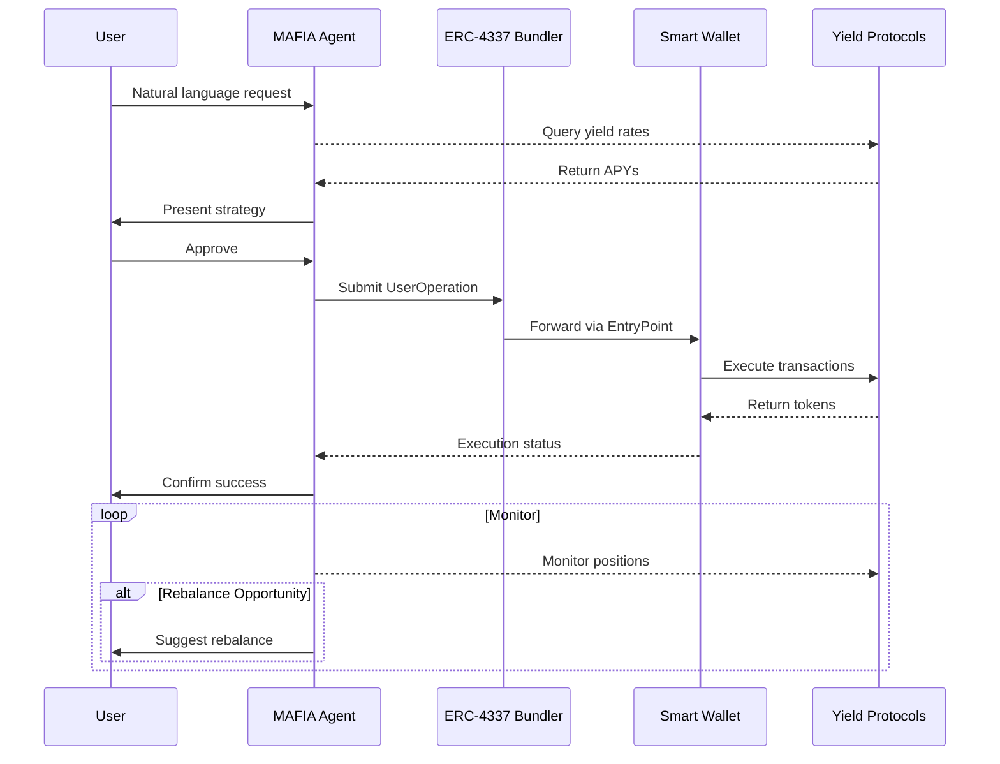

```mermaid
sequenceDiagram
    participant User as User
    participant MAFIA as MAFIA Agent
    participant Bundler as ERC-4337 Bundler
    participant Wallet as Smart Wallet
    participant Protocols as Yield Protocols
    
    User->>MAFIA: Natural language request
    MAFIA-->>Protocols: Query yield rates
    Protocols-->>MAFIA: Return APYs
    
    MAFIA->>User: Present strategy
    User->>MAFIA: Approve
    
    MAFIA->>Bundler: Submit UserOperation
    Bundler->>Wallet: Forward via EntryPoint
    
    Wallet->>Protocols: Execute transactions
    Protocols-->>Wallet: Return tokens
    
    Wallet-->>MAFIA: Execution status
    MAFIA->>User: Confirm success
    
    loop Monitor
        MAFIA-->>Protocols: Monitor positions
        alt Rebalance Opportunity
            MAFIA->>User: Suggest rebalance
        end
    end
```