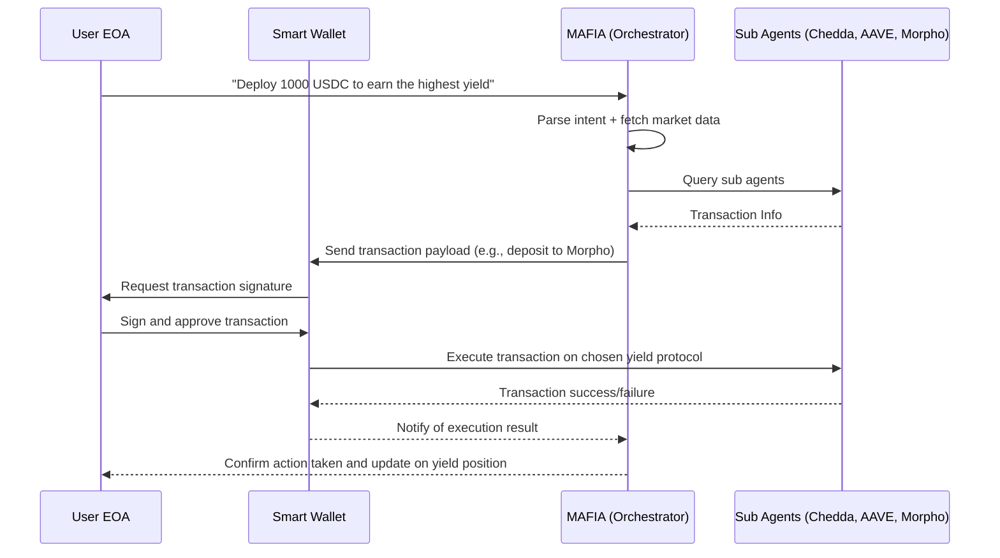

```mermaid
sequenceDiagram
    participant U as User EOA
    participant SW as Smart Wallet
    participant AI as MAFIA (Orchestrator)
    participant SA as Sub Agents (Chedda, AAVE, Morpho)

    %% Step 1: User input
    U->>AI: "Deploy 1000 USDC to earn the highest yield"

    %% Step 2: Agent processes intent
    AI->>AI: Parse intent + fetch market data
    AI->>SA: Query sub agents
    SA-->>AI: Transaction Info

    %% Step 3: Transaction handoff
    AI->>SW: Send transaction payload (e.g., deposit to Morpho)

    %% Step 4: Smart wallet execution
    SW->>U: Request transaction signature
    U->>SW: Sign and approve transaction
    SW->>SA: Execute transaction on chosen yield protocol

    %% Step 5: Confirmation
    SA-->>SW: Transaction success/failure
    SW-->>AI: Notify of execution result
    AI-->>U: Confirm action taken and update on yield position

```