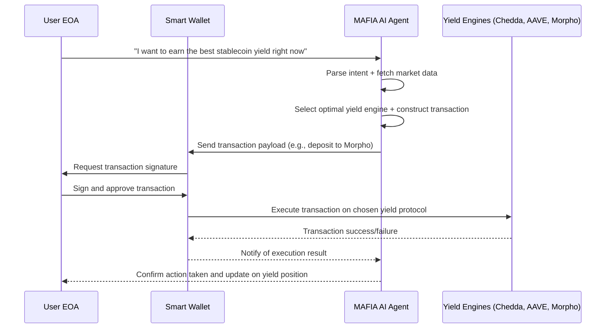

```mermaid
sequenceDiagram
    participant U as User EOA
    participant SW as Smart Wallet
    participant AI as MAFIA AI Agent
    participant YE as Yield Engines (Chedda, AAVE, Morpho)

    %% Step 1: User input
    U->>AI: "I want to earn the best stablecoin yield right now"

    %% Step 2: Agent processes intent
    AI->>AI: Parse intent + fetch market data
    AI->>AI: Select optimal yield engine + construct transaction

    %% Step 3: Transaction handoff
    AI->>SW: Send transaction payload (e.g., deposit to Morpho)

    %% Step 4: Smart wallet execution
    SW->>U: Request transaction signature
    U->>SW: Sign and approve transaction
    SW->>YE: Execute transaction on chosen yield protocol

    %% Step 5: Confirmation
    YE-->>SW: Transaction success/failure
    SW-->>AI: Notify of execution result
    AI-->>U: Confirm action taken and update on yield position

```