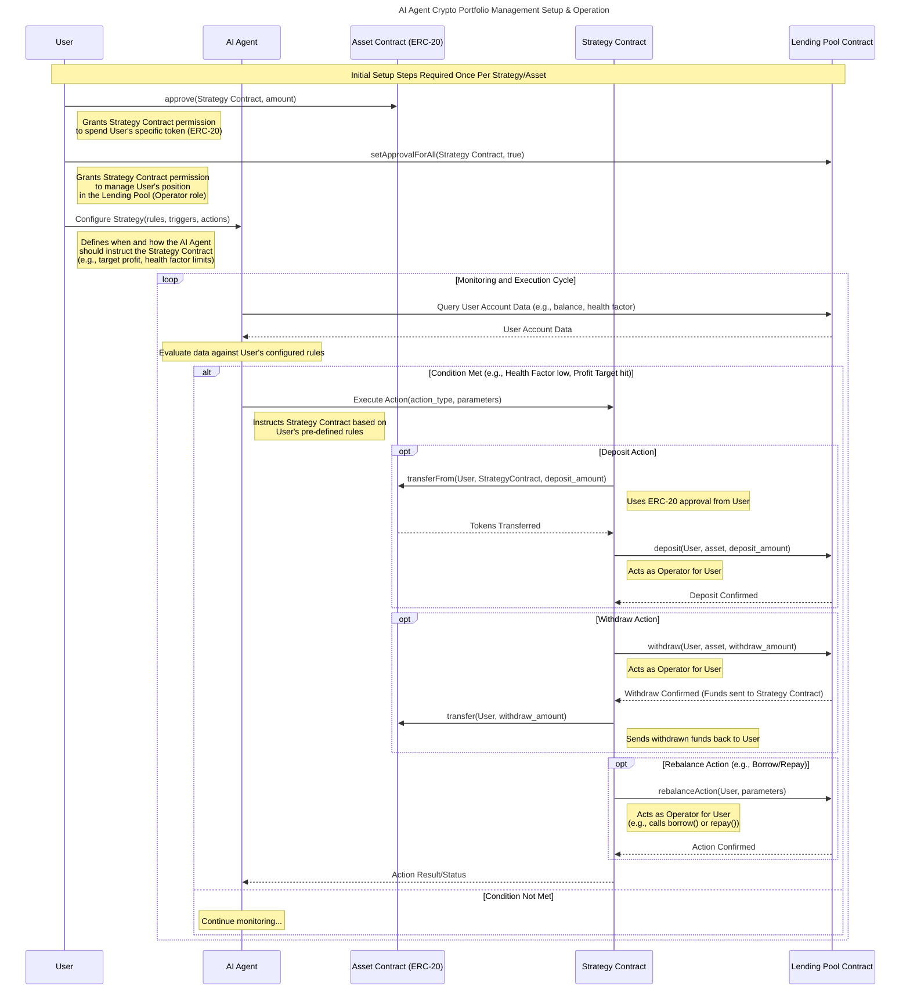

```mermaid
sequenceDiagram
    participant User
    participant AI Agent
    participant Asset Contract (ERC-20)
    participant Strategy Contract
    participant Lending Pool Contract

    title AI Agent Crypto Portfolio Management Setup & Operation

    %% -- Setup Phase --
    Note over User, Lending Pool Contract: Initial Setup Steps Required Once Per Strategy/Asset

    User->>Asset Contract (ERC-20): approve(Strategy Contract, amount)
    Note right of User: Grants Strategy Contract permission<br/>to spend User's specific token (ERC-20)

    User->>Lending Pool Contract: setApprovalForAll(Strategy Contract, true)
    Note right of User: Grants Strategy Contract permission<br/>to manage User's position<br/>in the Lending Pool (Operator role)

    User->>AI Agent: Configure Strategy(rules, triggers, actions)
    Note right of User: Defines when and how the AI Agent<br/>should instruct the Strategy Contract<br/>(e.g., target profit, health factor limits)

    %% -- Operational Phase (Continuous Loop) --
    loop Monitoring and Execution Cycle
        AI Agent->>Lending Pool Contract: Query User Account Data (e.g., balance, health factor)
        Lending Pool Contract-->>AI Agent: User Account Data

        Note over AI Agent: Evaluate data against User's configured rules

        alt Condition Met (e.g., Health Factor low, Profit Target hit)
            AI Agent->>Strategy Contract: Execute Action(action_type, parameters)
            Note right of AI Agent: Instructs Strategy Contract based on<br/>User's pre-defined rules

            %% Example Actions (Strategy Contract executes using granted permissions)
            opt Deposit Action
                Strategy Contract->>Asset Contract (ERC-20): transferFrom(User, StrategyContract, deposit_amount)
                Note right of Strategy Contract: Uses ERC-20 approval from User
                Asset Contract (ERC-20)-->>Strategy Contract: Tokens Transferred
                Strategy Contract->>Lending Pool Contract: deposit(User, asset, deposit_amount)
                Note right of Strategy Contract: Acts as Operator for User
                Lending Pool Contract-->>Strategy Contract: Deposit Confirmed
            end
            opt Withdraw Action
                 Strategy Contract->>Lending Pool Contract: withdraw(User, asset, withdraw_amount)
                 Note right of Strategy Contract: Acts as Operator for User
                 Lending Pool Contract-->>Strategy Contract: Withdraw Confirmed (Funds sent to Strategy Contract)
                 Strategy Contract->>Asset Contract (ERC-20): transfer(User, withdraw_amount)
                 Note right of Strategy Contract: Sends withdrawn funds back to User
            end
            opt Rebalance Action (e.g., Borrow/Repay)
                 Strategy Contract->>Lending Pool Contract: rebalanceAction(User, parameters)
                 Note right of Strategy Contract: Acts as Operator for User<br/>(e.g., calls borrow() or repay())
                 Lending Pool Contract-->>Strategy Contract: Action Confirmed
            end

            Strategy Contract-->>AI Agent: Action Result/Status
        else Condition Not Met
            Note over AI Agent: Continue monitoring...
        end
    end
```