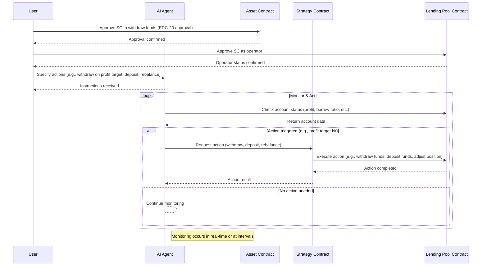

```mermaid
sequenceDiagram
    participant U as User
    participant AI as AI Agent
    participant AC as Asset Contract
    participant SC as Strategy Contract
    participant LPC as Lending Pool Contract

    %% Step 1: User approves Strategy Contract to withdraw funds
    U->>AC: Approve SC to withdraw funds (ERC-20 approval)
    AC-->>U: Approval confirmed

    %% Step 2: User approves Strategy Contract as operator for Lending Pool
    U->>LPC: Approve SC as operator
    LPC-->>U: Operator status confirmed

    %% Step 3: User instructs AI Agent
    U->>AI: Specify actions (e.g., withdraw on profit target, deposit, rebalance)
    AI-->>U: Instructions received

    %% Continuous Monitoring Loop
    loop Monitor & Act
        AI->>LPC: Check account status (profit, borrow ratio, etc.)
        LPC-->>AI: Return account data
        alt Action triggered (e.g., profit target hit)
            AI->>SC: Request action (withdraw, deposit, rebalance)
            SC->>LPC: Execute action (e.g., withdraw funds, deposit funds, adjust position)
            LPC-->>SC: Action completed
            SC-->>AI: Action result
        else No action needed
            AI-->AI: Continue monitoring
        end
    end

    %% Note: Continuous process
    note right of AI: Monitoring occurs in real-time or at intervals
```