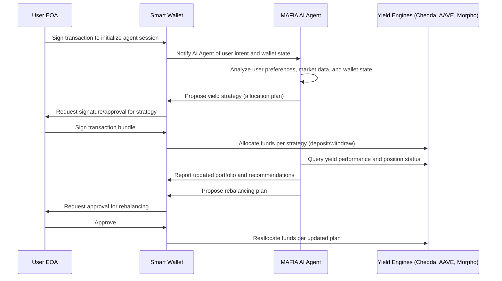

```mermaid
sequenceDiagram
    participant U as User EOA
    participant SW as Smart Wallet
    participant AI as MAFIA AI Agent
    participant YE as Yield Engines (Chedda, AAVE, Morpho)

    %% Step 1: Initialization
    U->>SW: Sign transaction to initialize agent session
    SW->>AI: Notify AI Agent of user intent and wallet state

    %% Step 2: AI Strategy Computation
    AI->>AI: Analyze user preferences, market data, and wallet state
    AI->>SW: Propose yield strategy (allocation plan)

    %% Step 3: Execution
    SW->>U: Request signature/approval for strategy
    U->>SW: Sign transaction bundle
    SW->>YE: Allocate funds per strategy (deposit/withdraw)

    %% Step 4: Monitoring
    AI->>YE: Query yield performance and position status
    AI->>SW: Report updated portfolio and recommendations

    %% Step 5: Rebalancing (Optional)
    AI->>SW: Propose rebalancing plan
    SW->>U: Request approval for rebalancing
    U->>SW: Approve
    SW->>YE: Reallocate funds per updated plan

```