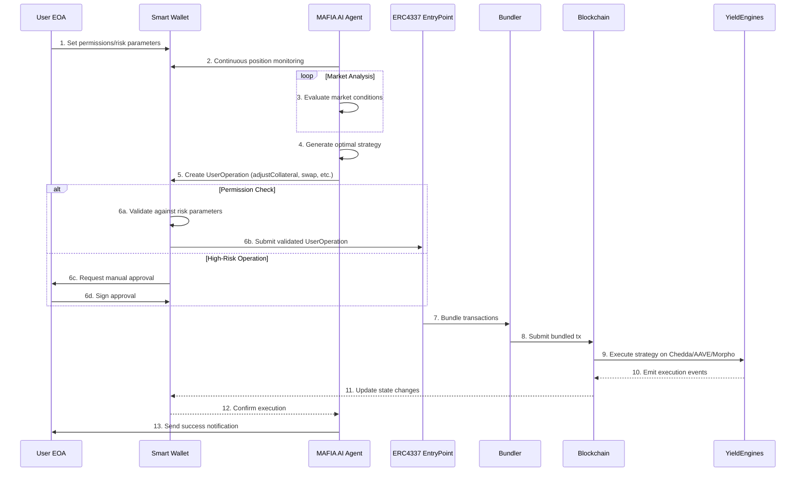

```mermaid
sequenceDiagram
    participant User EOA
    participant Smart Wallet
    participant MAFIA AI Agent
    participant ERC4337 EntryPoint
    participant Bundler
    participant Blockchain
    participant YieldEngines

    User EOA->>Smart Wallet: 1. Set permissions/risk parameters
    MAFIA AI Agent->>Smart Wallet: 2. Continuous position monitoring
    loop Market Analysis
        MAFIA AI Agent->>MAFIA AI Agent: 3. Evaluate market conditions
    end
    
    MAFIA AI Agent->>MAFIA AI Agent: 4. Generate optimal strategy
    MAFIA AI Agent->>Smart Wallet: 5. Create UserOperation (adjustCollateral, swap, etc.)
    
    alt Permission Check
        Smart Wallet->>Smart Wallet: 6a. Validate against risk parameters
        Smart Wallet->>ERC4337 EntryPoint: 6b. Submit validated UserOperation
    else High-Risk Operation
        Smart Wallet->>User EOA: 6c. Request manual approval
        User EOA->>Smart Wallet: 6d. Sign approval
    end
    
    ERC4337 EntryPoint->>Bundler: 7. Bundle transactions
    Bundler->>Blockchain: 8. Submit bundled tx
    Blockchain->>YieldEngines: 9. Execute strategy on Chedda/AAVE/Morpho
    YieldEngines-->>Blockchain: 10. Emit execution events
    Blockchain-->>Smart Wallet: 11. Update state changes
    Smart Wallet-->>MAFIA AI Agent: 12. Confirm execution
    MAFIA AI Agent->>User EOA: 13. Send success notification

```