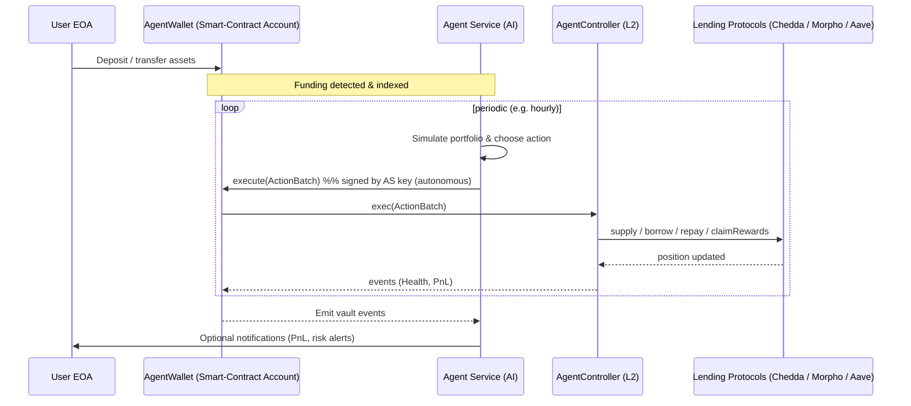

```mermaid
sequenceDiagram
    participant U as User EOA
    participant AW as AgentWallet (Smart‑Contract Account)
    participant AS as Agent Service (AI)
    participant AC as AgentController (L2)
    participant LP as Lending Protocols (Chedda / Morpho / Aave)

    U->>AW: Deposit / transfer assets
    Note over AW,AS: Funding detected & indexed
    loop periodic (e.g. hourly)
        AS->>AS: Simulate portfolio & choose action
        AS->>AW: execute(ActionBatch)  %% signed by AS key (autonomous)
        AW->>AC: exec(ActionBatch)
        AC->>LP: supply / borrow / repay / claimRewards
        LP-->>AC: position updated
        AC-->>AW: events (Health, PnL)
    end
    AW-->>AS: Emit vault events
    AS->>U: Optional notifications (PnL, risk alerts)
```