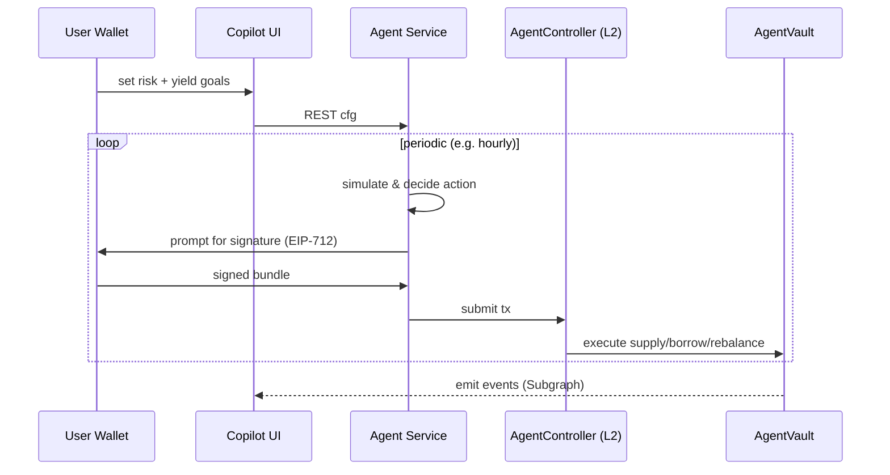

```mermaid
sequenceDiagram
  participant U as User Wallet
  participant UI as Copilot UI
  participant AS as Agent Service
  participant AC as AgentController (L2)
  participant AV as AgentVault

  U->>UI: set risk + yield goals
  UI->>AS: REST cfg
  loop periodic (e.g. hourly)
    AS->>AS: simulate & decide action
    AS->>U: prompt for signature (EIP‑712)
    U->>AS: signed bundle
    AS->>AC: submit tx
    AC->>AV: execute supply/borrow/rebalance
  end
  AV-->>UI: emit events (Subgraph)
```