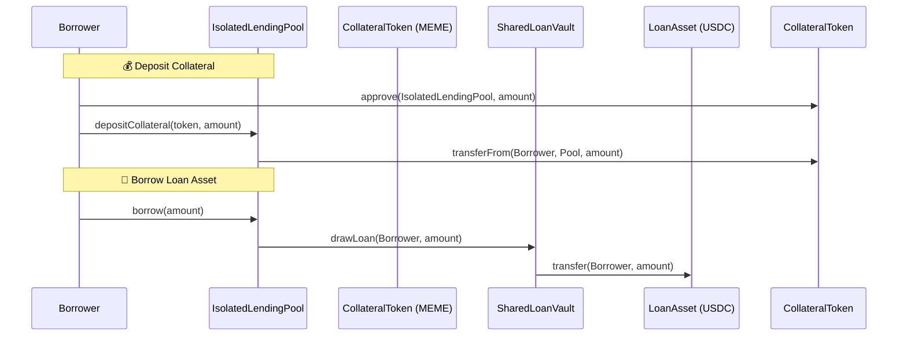

```mermaid
sequenceDiagram
    participant Borrower
    participant IsolatedLendingPool
    participant CollateralToken (MEME)
    participant SharedLoanVault
    participant LoanAsset (USDC)

    Note over Borrower, IsolatedLendingPool: 💰 Deposit Collateral
    Borrower->>CollateralToken: approve(IsolatedLendingPool, amount)
    Borrower->>IsolatedLendingPool: depositCollateral(token, amount)
    IsolatedLendingPool->>CollateralToken: transferFrom(Borrower, Pool, amount)

    Note over Borrower, IsolatedLendingPool: 🏦 Borrow Loan Asset
    Borrower->>IsolatedLendingPool: borrow(amount)
    IsolatedLendingPool->>SharedLoanVault: drawLoan(Borrower, amount)
    SharedLoanVault->>LoanAsset (USDC): transfer(Borrower, amount)

```