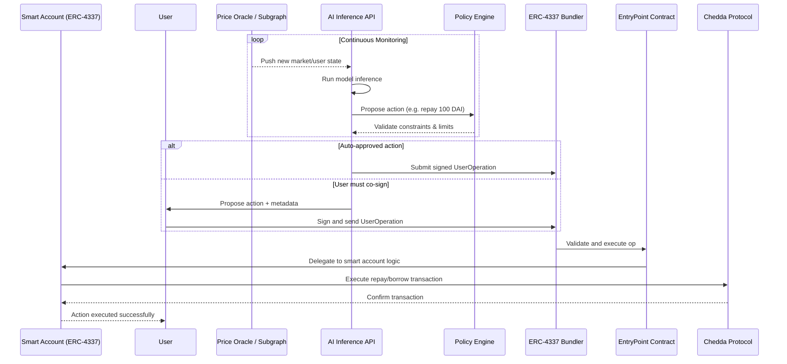

```mermaid
sequenceDiagram
    participant Wallet as Smart Account (ERC-4337)
    participant User as User
    participant Oracle as Price Oracle / Subgraph
    participant AIService as AI Inference API
    participant PolicyEngine as Policy Engine
    participant Bundler as ERC-4337 Bundler
    participant EntryPoint as EntryPoint Contract
    participant Protocol as Chedda Protocol

    loop Continuous Monitoring
        Oracle-->>AIService: Push new market/user state
        AIService->>AIService: Run model inference
        AIService->>PolicyEngine: Propose action (e.g. repay 100 DAI)
        PolicyEngine-->>AIService: Validate constraints & limits
    end

    alt Auto-approved action
        AIService->>Bundler: Submit signed UserOperation
    else User must co-sign
        AIService->>User: Propose action + metadata
        User->>Bundler: Sign and send UserOperation
    end

    Bundler->>EntryPoint: Validate and execute op
    EntryPoint->>Wallet: Delegate to smart account logic
    Wallet->>Protocol: Execute repay/borrow transaction
    Protocol-->>Wallet: Confirm transaction
    Wallet-->>User: Action executed successfully

```