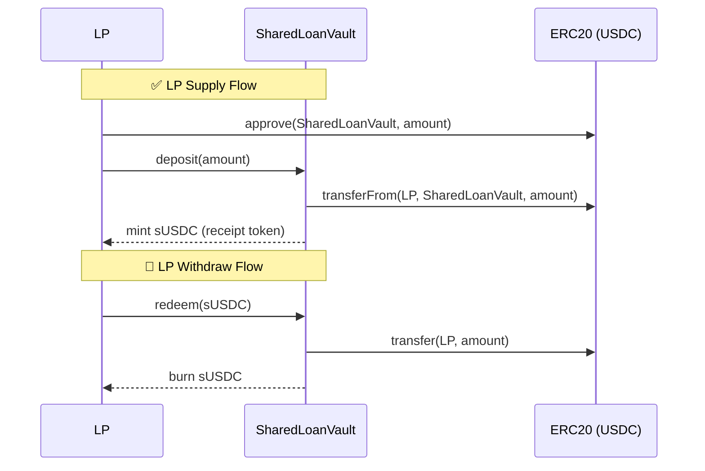

```mermaid
sequenceDiagram
    participant LP
    participant SharedLoanVault
    participant ERC20 (USDC)

    Note over LP, SharedLoanVault: ✅ LP Supply Flow
    LP->>ERC20 (USDC): approve(SharedLoanVault, amount)
    LP->>SharedLoanVault: deposit(amount)
    SharedLoanVault->>ERC20 (USDC): transferFrom(LP, SharedLoanVault, amount)
    SharedLoanVault-->>LP: mint sUSDC (receipt token)

    Note over LP, SharedLoanVault: 🔄 LP Withdraw Flow
    LP->>SharedLoanVault: redeem(sUSDC)
    SharedLoanVault->>ERC20 (USDC): transfer(LP, amount)
    SharedLoanVault-->>LP: burn sUSDC
```