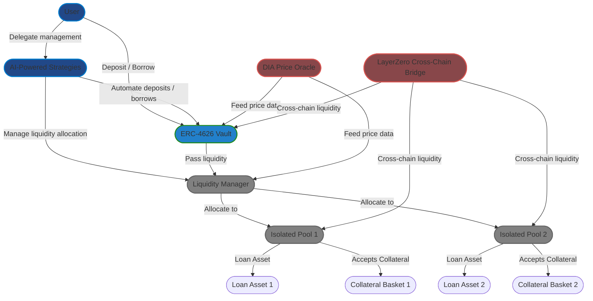

```mermaid
flowchart TD
  %% Users
  User([User])
  
  %% AI Agents
  AIAgent([AI-Powered Strategies])

  %% Core Vault System
  Vault([ERC-4626 Vault])

  %% Liquidity Manager
  LiquidityManager([Liquidity Manager])

  %% Isolated Pools
  Pool1([Isolated Pool 1])
  Pool2([Isolated Pool 2])

  LoanAsset1([Loan Asset 1])
  LoanAsset2([Loan Asset 2])

  CollateralAssets1([Collateral Basket 1])
  CollateralAssets2([Collateral Basket 2])

  %% External Services
  Oracle([DIA Price Oracle])
  CrossChainBridge([LayerZero Cross-Chain Bridge])

  %% User interactions
  User --> |Deposit / Borrow| Vault
  User --> |Delegate management| AIAgent

  %% AI Agent operations
  AIAgent --> |Automate deposits / borrows| Vault
  AIAgent --> |Manage liquidity allocation| LiquidityManager

  %% Vault operations
  Vault --> |Pass liquidity| LiquidityManager

  %% Liquidity Manager allocates liquidity
  LiquidityManager --> |Allocate to| Pool1
  LiquidityManager --> |Allocate to| Pool2

  %% Pools
  Pool1 --> |Loan Asset| LoanAsset1
  Pool1 --> |Accepts Collateral| CollateralAssets1

  Pool2 --> |Loan Asset| LoanAsset2
  Pool2 --> |Accepts Collateral| CollateralAssets2

  %% Oracles and Bridges
  Oracle --> |Feed price data| Vault
  Oracle --> |Feed price data| LiquidityManager
  
  CrossChainBridge --> |Cross-chain liquidity| Vault
  CrossChainBridge --> |Cross-chain liquidity| Pool1
  CrossChainBridge --> |Cross-chain liquidity| Pool2

  %% Styles
  classDef user fill:#214888,stroke:#007acc,stroke-width:2px;
  classDef ai fill:#9992cc,stroke:#ff9900,stroke-width:2px;
  classDef vault fill:#2280cb,stroke:#228b22,stroke-width:2px;
  classDef liquidity fill:#808080,stroke:#666,stroke-width:2px;
  classDef external fill:#88474a,stroke:#d9534f,stroke-width:2px;
  class User,AIAgent user;
  class Vault vault;
  class LiquidityManager,Pool1,Pool2 liquidity;
  class Oracle,CrossChainBridge external;
```