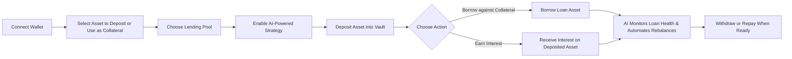

```mermaid
flowchart LR
  A[Connect Wallet] --> B[Select Asset to Deposit or Use as Collateral]
  B --> C[Choose Lending Pool]
  C --> D[Enable AI-Powered Strategy]
  D --> E[Deposit Asset into Vault]
  E --> F{Choose Action}
  F --> |Borrow against Collateral| G[Borrow Loan Asset]
  F --> |Earn Interest| H[Receive Interest on Deposited Asset]
  G --> I[AI Monitors Loan Health & Automates Rebalances]
  H --> I
  I --> J[Withdraw or Repay When Ready]
```