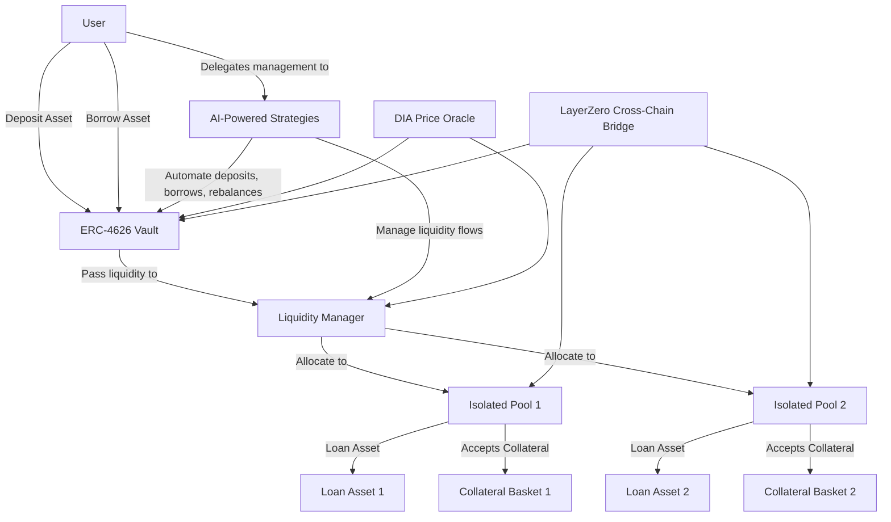

```mermaid
flowchart TD
  %% Users and Assets
  User[User] --> |Deposit Asset| Vault[ERC-4626 Vault]
  User --> |Borrow Asset| Vault

  %% Vault operations
  Vault --> |Pass liquidity to| LiquidityManager[Liquidity Manager]
  LiquidityManager --> |Allocate to| Pool1[Isolated Pool 1]
  LiquidityManager --> |Allocate to| Pool2[Isolated Pool 2]

  %% Pools and Collateral
  Pool1 --> |Loan Asset| LoanAsset1[Loan Asset 1]
  Pool1 --> |Accepts Collateral| CollateralAssets1[Collateral Basket 1]
  Pool2 --> |Loan Asset| LoanAsset2[Loan Asset 2]
  Pool2 --> |Accepts Collateral| CollateralAssets2[Collateral Basket 2]

  %% AI Agent Layer
  User --> |Delegates management to| AIAgent[AI-Powered Strategies]
  AIAgent --> |Automate deposits, borrows, rebalances| Vault
  AIAgent --> |Manage liquidity flows| LiquidityManager

  %% Oracle Integration
  Oracle[DIA Price Oracle] --> Vault
  Oracle --> LiquidityManager

  %% Cross-chain Layer
  CrossChainBridge[LayerZero Cross-Chain Bridge] --> Vault
  CrossChainBridge --> Pool1
  CrossChainBridge --> Pool2


```