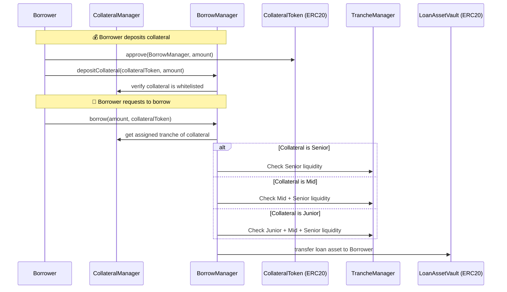

```mermaid
sequenceDiagram
    participant Borrower
    participant CollateralManager
    participant BorrowManager
    participant CollateralToken (ERC20)
    participant TrancheManager
    participant LoanAssetVault (ERC20)

    Note over Borrower, BorrowManager: 💰 Borrower deposits collateral
    Borrower->>CollateralToken (ERC20): approve(BorrowManager, amount)
    Borrower->>BorrowManager: depositCollateral(collateralToken, amount)
    BorrowManager->>CollateralManager: verify collateral is whitelisted

    Note over Borrower, BorrowManager: 🏦 Borrower requests to borrow
    Borrower->>BorrowManager: borrow(amount, collateralToken)
    BorrowManager->>CollateralManager: get assigned tranche of collateral

    alt Collateral is Senior
        BorrowManager->>TrancheManager: Check Senior liquidity
    else Collateral is Mid
        BorrowManager->>TrancheManager: Check Mid + Senior liquidity
    else Collateral is Junior
        BorrowManager->>TrancheManager: Check Junior + Mid + Senior liquidity
    end

    BorrowManager->>LoanAssetVault (ERC20): transfer loan asset to Borrower

```