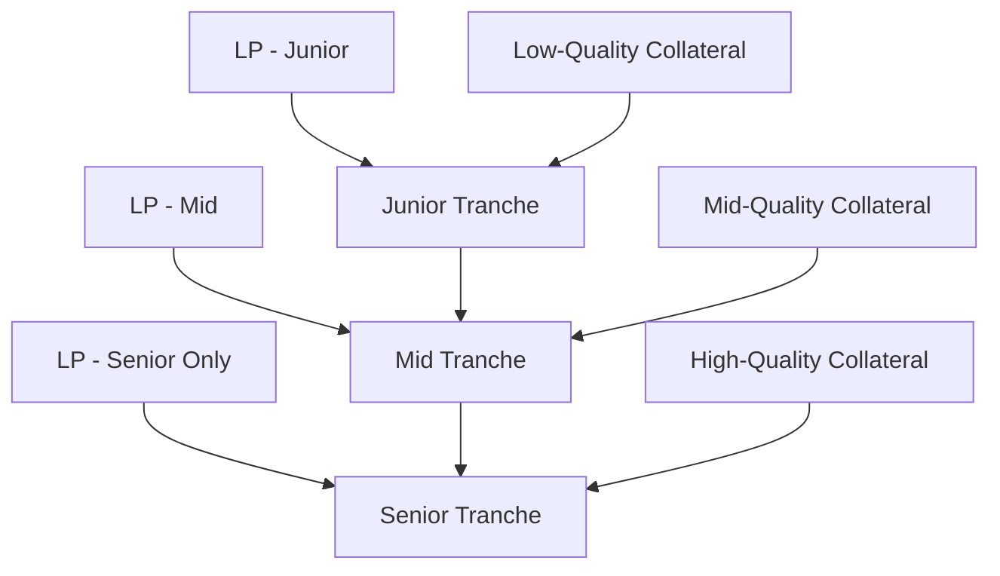

```mermaid
flowchart TB
    LP1[LP - Senior Only] --> Senior[Senior Tranche]
    LP2[LP - Mid] --> Mid[Mid Tranche]
    LP3[LP - Junior] --> Junior[Junior Tranche]
    Junior --> Mid
    Mid --> Senior

    Borrower1[High-Quality Collateral] --> Senior
    Borrower2[Mid-Quality Collateral] --> Mid
    Borrower3[Low-Quality Collateral] --> Junior

```