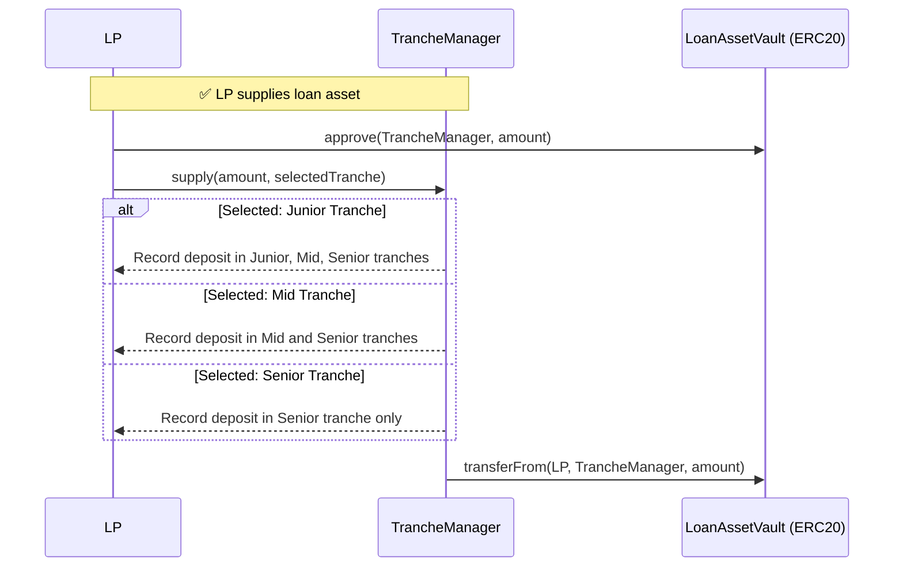

```mermaid
sequenceDiagram
    participant LP
    participant TrancheManager
    participant LoanAssetVault (ERC20)

    Note over LP, TrancheManager: ✅ LP supplies loan asset
    LP->>LoanAssetVault (ERC20): approve(TrancheManager, amount)
    LP->>TrancheManager: supply(amount, selectedTranche)

    alt Selected: Junior Tranche
        TrancheManager-->>LP: Record deposit in Junior, Mid, Senior tranches
    else Selected: Mid Tranche
        TrancheManager-->>LP: Record deposit in Mid and Senior tranches
    else Selected: Senior Tranche
        TrancheManager-->>LP: Record deposit in Senior tranche only
    end

    TrancheManager->>LoanAssetVault (ERC20): transferFrom(LP, TrancheManager, amount)

```